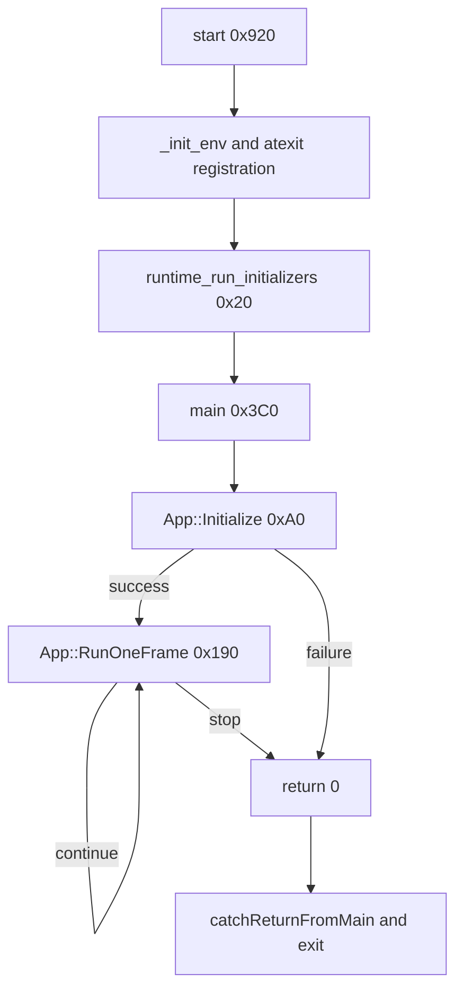

# Startup path

IDA's entry point is `start` at `0x920`. It performs the platform runtime setup,
runs static initialization, calls the game routine, and passes the returned
status to two imported termination stubs.

## Recovered functions

| Address | IDA name | Confidence | Evidence |
| --- | --- | --- | --- |
| `0x20` | `runtime_run_initializers` | High, inferred | Walks a table backward, skips null entries, stops at `-1`, and calls each function before `main`. |
| `0xA0` | `App::Initialize` | High, inferred | Called once before the loop; its complete top-level sequence is reconstructed in `src/rockband/app/Main.cpp`. |
| `0x190` | `App::RunOneFrame` | High, inferred | Called repeatedly by `main`; updates many global systems and returns the loop continuation condition. |
| `0x3C0` | `main` | High, inferred | Calls initialization once, then calls `App::RunOneFrame` until it returns false. |
| `0x12431A0` | `runtime_run_finalizers` | High, inferred | Registered from `start`; invokes a finalizer table at most once. |

These descriptive names are stored in the local IDA database and exported in
`analysis/exports/functions.csv`. They are not claimed as original symbols.

## Entrypoint imports

The matching SDK stubs resolve every platform import used directly by `start`:

| Address | Imported symbol | Role |
| --- | --- | --- |
| `0x1243220` | `_init_env` | Initializes the C runtime from the initial process stack. |
| `0x1243230` | `atexit` | Registers the loader cleanup and executable finalizer callbacks. |
| `0x1243240` | `catchReturnFromMain` | Passes the game return status back to the runtime. |
| `0x1243250` | `exit` | Terminates the process with that status. |

These names come from the binary NIDs in the PS4 SDK 5.008 stub libraries,
rather than from control-flow inference. The raw entry-point decompilation is
stored in `analysis/exports/entrypoint.c`.

## First source reconstruction

The control flow at `0x3C0` reduces to the implementation in
`src/rockband/app/Main.cpp`. The executable passes `argc`, `argv`, and `envp`, but this
build does not read them inside `main`.
