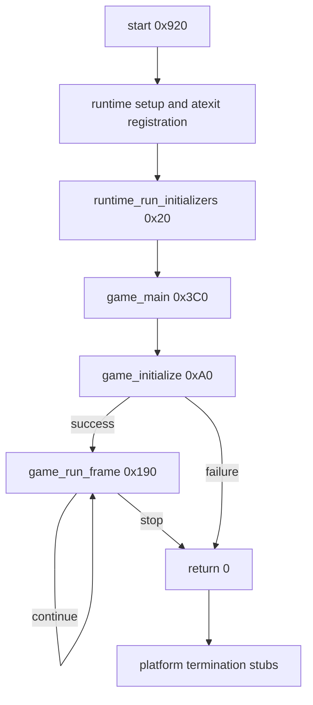

# Startup path

IDA's entry point is `start` at `0x920`. It performs the platform runtime setup,
runs static initialization, calls the game routine, and passes the returned
status to two imported termination stubs.

## Recovered functions

| Address | IDA name | Confidence | Evidence |
| --- | --- | --- | --- |
| `0x20` | `runtime_run_initializers` | High, inferred | Walks a table backward, skips null entries, stops at `-1`, and calls each function before `game_main`. |
| `0xA0` | `game_initialize` | High, inferred | Called once before the loop; initializes many subsystems and directly references `config/rockband.dta`. |
| `0x190` | `game_run_frame` | High, inferred | Called repeatedly by `game_main`; updates many global systems and returns the loop continuation condition. |
| `0x3C0` | `game_main` | High, inferred | Calls initialization once, then calls `game_run_frame` until it returns false. |
| `0x12431A0` | `runtime_run_finalizers` | High, inferred | Registered from `start`; invokes a finalizer table at most once. |

These descriptive names are stored in the local IDA database and exported in
`analysis/exports/functions.csv`. They are not claimed as original symbols.

## Entrypoint imports

The generic ELF loader does not currently resolve the PS4 NID imports, so the
five PLT stubs called by `start` remain address-named. Control flow strongly
suggests that the repeated stub at `0x1243230` registers exit handlers and that
the last two stubs terminate the process. Those labels will remain unchanged
until the Orbis dynamic symbol and relocation data provide direct evidence.

## First source reconstruction

The control flow at `0x3C0` reduces to the implementation in
`src/game/main.cpp`. The executable passes `argc`, `argv`, and `envp`, but this
build does not read them inside `game_main`.
